# AI-Powered Self-Service Data Platform — Vision & POC

## 1. Conceptual Understanding

An **AI-powered self-service data platform** enables non-technical business users (sales, operations, finance) to query data, generate reports, and derive insights using natural language — eliminating dependency on data engineering/analytics teams for routine questions.

**Business problems solved:**
- Reduces analytics backlog (data team spends < 30% time on strategic work)
- Empowers faster decision-making at the operational level
- Democratises data access across the organisation

**Challenges introduced:**
- Hallucination risk from LLM-generated queries
- Semantic ambiguity in business questions ("active customer" can mean different things)
- Data governance — who can see what data
- Trust calibration — users must know when to trust vs. verify

## 2. Experience & Examples

**Related project:** Built a fully functional NL-to-SQL analytics assistant for SunCulture using LangGraph + OpenAI GPT-4o + Streamlit.

**Role:** Designed and implemented the entire LangGraph agent pipeline — SQL generation, validation (regex + AST parsing to block DDL/DML), execution, result interpretation, and conversational context tracking. Integrated schema discovery to dynamically expose table structures and sample values to the LLM.

**Links:**
- Source code: `deployment/streamlit_app.py` — the complete Streamlit + LangGraph application
- Architecture: **NL Query → LLM → SQL → Validation → Execution → LLM → NL Answer + Chart** — with automatic retry on validation failure (up to 2 attempts) and suggested follow-up questions

**Demo workflow:**
1. User types a business question in natural language
2. LangGraph agent generates SQL from the discovered schema
3. Validation layer rejects destructive or malformed queries
4. SQL executes against the in-memory SQLite database
5. A second LLM call translates the raw result into a business insight
6. Streamlit renders the answer, the generated SQL (expandable), and optionally a chart

## 3. POC Proposal

Using the assessment dataset, build a **Streamlit app** with:
- **LLM backend:** LangGraph + OpenAI GPT-4
- **Query engine:** SQLite in-memory database loaded with the 8 tables
- **Validation layer:** Regex + AST parsing to reject DDL/DML statements
- **Output:** Natural language answer + optional Plotly chart

**Tools:** Streamlit, LangGraph, OpenAI, SQLite, Plotly

## 4. Business Readiness & Adoption

**Prerequisites for adoption:**
- **Data governance:** Row-level security policies; user authentication tied to data access roles
- **Culture:** Leadership must encourage data-driven decision-making and accept AI-generated insights with appropriate caveats
- **Infrastructure:** A centralised data warehouse (BigQuery/Snowflake) with well-documented schemas and column-level descriptions
- **Change management:** Train business users on how to ask effective questions and how to interpret AI-generated answers

**Measuring success:**
- **Technical:** Query accuracy rate (% of NL questions that return correct SQL), latency < 5s
- **Organisational:** Reduction in ad-hoc analytics requests to the data team, user satisfaction score > 4/5

## 5. Future Enhancements

- **Feedback loops:** Thumbs-up/down on each answer → fine-tune prompt templates and ground truth SQL corpus
- **Human-in-the-loop validation:** Sensitive queries (PII, financial aggregates) routed to a human reviewer before execution
- **Multi-turn conversations:** Maintain context across follow-up questions ("What about last quarter?")
- **Explainability:** Show the generated SQL and a confidence score alongside the answer to build trust
- **Embedding-based retrieval:** Use vector search to find similar previously-answered questions for faster response and consistent answers

## Architecture Diagram

```mermaid
flowchart LR
    User["Business User"] --> QA["Ask question<br>in natural language"]
    QA --> GenSQL["generate_sql<br>LLM: schema + question → SQL"]
    GenSQL --> Validate["validate_sql<br>Regex + AST: reject DDL/DML"]
    Validate -->|Invalid & retries < 2| GenSQL
    Validate -->|Valid| Execute["execute_sql<br>SQLite: run query"]
    Execute --> Interpret["interpret_result<br>LLM: data → business answer"]
    Interpret --> Output["NL answer + chart<br>Streamlit UI"]

    style User fill:#e1f5fe
    style Output fill:#e8f5e9
    style Validate fill:#fff3e0
    style GenSQL fill:#f3e5f5
    style Interpret fill:#f3e5f5
```

## Ethical Considerations

- **Data privacy:** Mask PII at query time; enforce RBAC at the database level
- **Hallucination control:** Constrain the LLM with schema-only context; validate SQL syntax before execution; display the generated SQL for transparency
- **Explainability:** Never return a number without context or source
